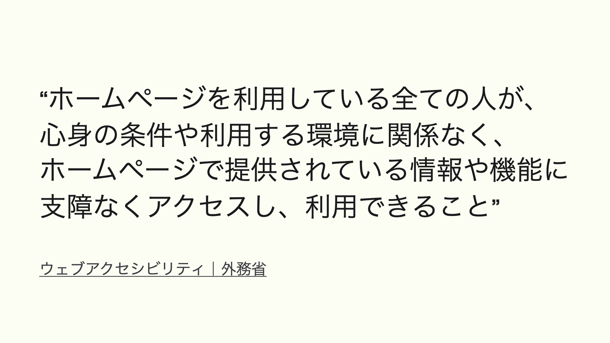
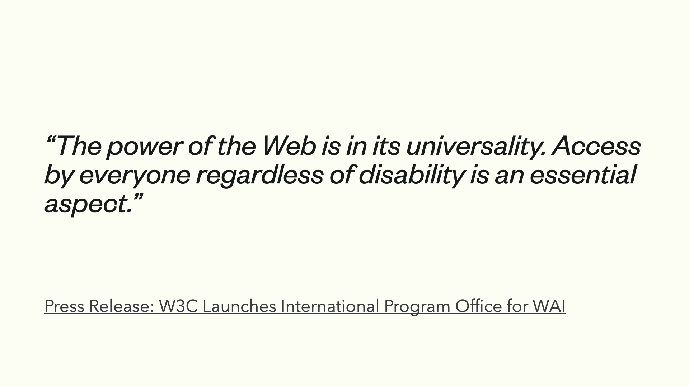
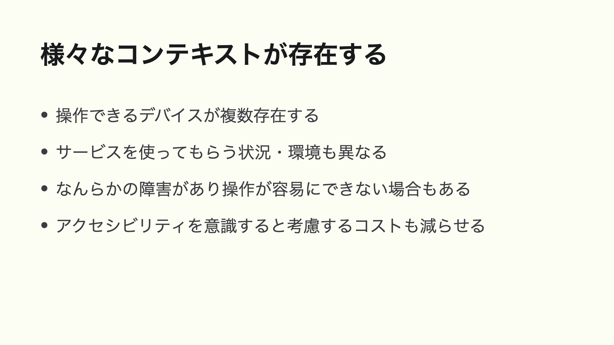
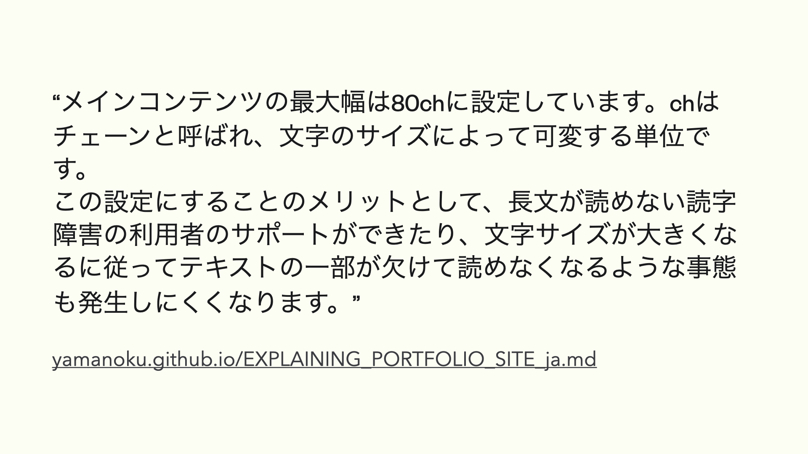
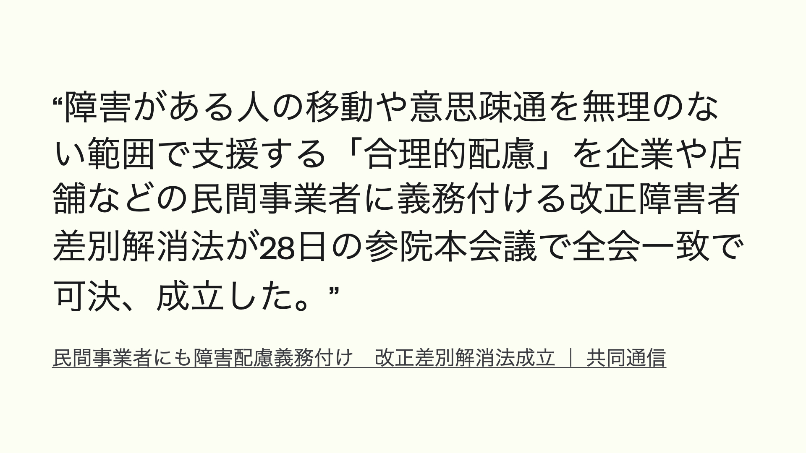
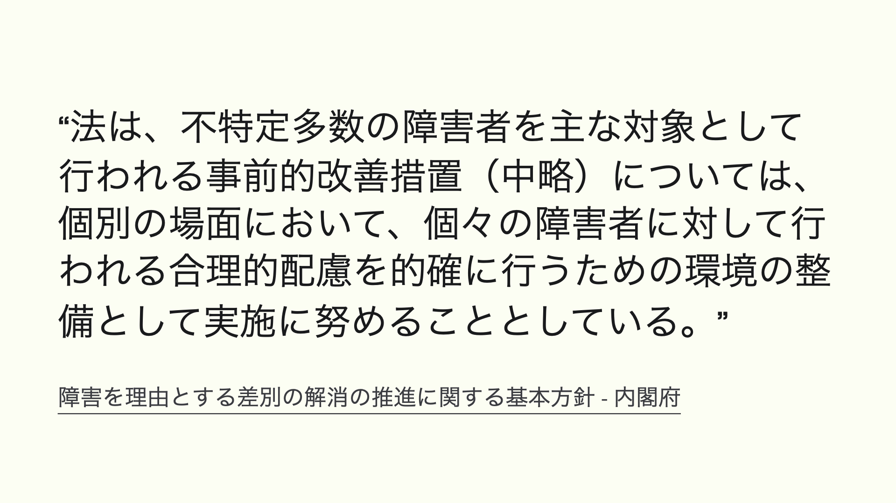
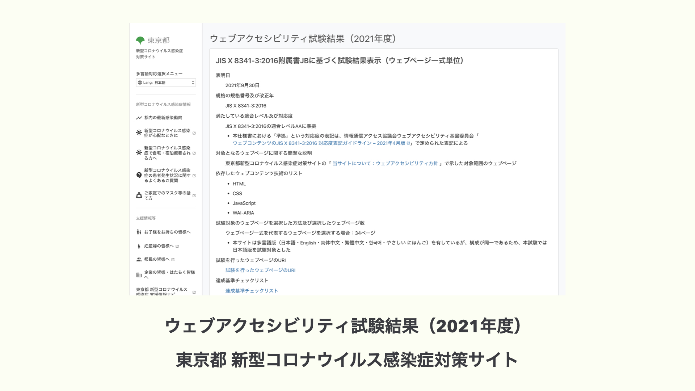

# アクセシビリティとは何か

フロントエンド開発をしている人であれば「アクセシビリティ」という言葉は耳にしたことがあると思います。

では、アクセシビリティとは一体何を意味する言葉なのでしょう。

アクセシビリティはあらゆる人がアクセスできるようになることを指します。

アクセスする、というと想像しづらいのですが、なんらかの情報を得られるようになる、とある機器やサービスを利用できるようになると言い換えるとイメージしやすいかもしれません。

では「ウェブアクセシビリティ」とは何でしょうか。

外務省の定義として _「ホームページを利用している全ての人が、心身の条件や利用する環境に関係なく、ホームページで提供されている情報や機能に支障なくアクセスし、利用できること」_ と書かれています。

ホームページというと個人のウェブサイトがイメージするかもしれませんが、ウェブブラウザ上で表示できるページのことを指していると解釈しています。

そもそもウェブとアクセシビリティはどういう関係があるのでしょうか。

ウェブの概念を提唱したティム・バーナーズ＝リー氏は _「ウェブのパワーは、その普遍性にある。障害の有無に関係なく、誰もが使えることが、その本質である」_ と説いています。

つまり、ウェブはもともとアクセシビリティが兼ね揃えたものであり、ウェブ上で仕事をする我々はアクセシビリティを享受・提供できているといっても差し支えありません。

事実、インターネットの環境が整っていれば「いつでも、どこでも、誰でも」アクセスすることができるのですから。

そんなウェブがもつアクセシビリティを守ることにはどういった恩恵があるでしょうか。
１つあるのが多様なユーザ層への考慮です。

かつてはデスクトップだけでウェブに触れていたものが、スマートフォンやタブレットといった機器が増えてきました。

使用する状況も室内や室外、それぞれでユースケースは異なってきます。なんらかの状況によって操作が容易ではなくなることもあるかもしれません。

ウェブ標準のものを意識することでアクセシビリティへの考慮コストもいくつか減らすことができます。

結果として多くのプロダクトやサービスを使う利用者層も獲得できて、分母の母数を増やすことにも繋がり、ビジネス面において貢献できる期待がもてます。

多様なユーザや多様なデバイスでアクセスできるようになるということは、言い換えれば一人ひとりがアクセスできるということでもあります。

デザインの領域でもアクセシビリティの考え方は活用することができます。

それは、感覚に寄らない「根拠のあるデザイン」をつくることです。

私の[ポートフォリオサイト](https://yamanoku.net)ではメインコンテンツの最大幅を文字サイズになるように設定しています。

これは視覚的提示するものをあらゆる人が読みやすくするための考慮のためでもあります。

アクセシビリティを根拠として設計することで万人にとっても理解しやすいきっかけにもなります。

また、日本とアクセシビリティに関連することとして、今年６月より民間企業への合理的配慮の提供を義務づけるように改正障害者差別解消法が交付されたことがあります。

**合理的配慮**とは、障害がある人のために負担が重すぎない範囲で社会的にバリアとなっているものを事業者がなくす対応のことです。これまで行政は対応必須となっていましたが、民間でもその対応が努力義務から義務化されました。

そんな中、ウェブアクセシビリティを含む情報アクセシビリティは、合理的配慮を的確に行うための環境の整備と位置づけられており、事前的改善措置として計画的に推進することが求められています。

サービス上で合理的配慮をするにあたり、だれでも行えるようにするための開発が「環境の整備」とも言えます。

今後、デジタル庁が主体となって情報アクセシビリティの保証が強くなってといいと感じています。

ウェブアクセシビリティは環境の整備と紹介しましたが、それらが考慮されているホームページはどういったものがあるか気になるところです。

日本のみなさんであればご存知かもしれない[東京都新型コロナウイルス感染症対策サイト](https://stopcovid19.metro.tokyo.lg.jp/)はアクセシビリティ考慮がされているサイトでもあります。

行政機関のホームページとして位置づけられているため、比較的厳格な基準でのウェブアクセシビリティの試験が実施され、その試験がパスされて準拠したという結果も発表されています。

ちなみにこのサイトは [Nuxt.js](https://nuxtjs.org/) で構築されており、[Vue.js](https://jp.vuejs.org/index.html) を使用した日本でもっともアクセシビリティが重視されたサイトと言ってもいいかも知れません。
