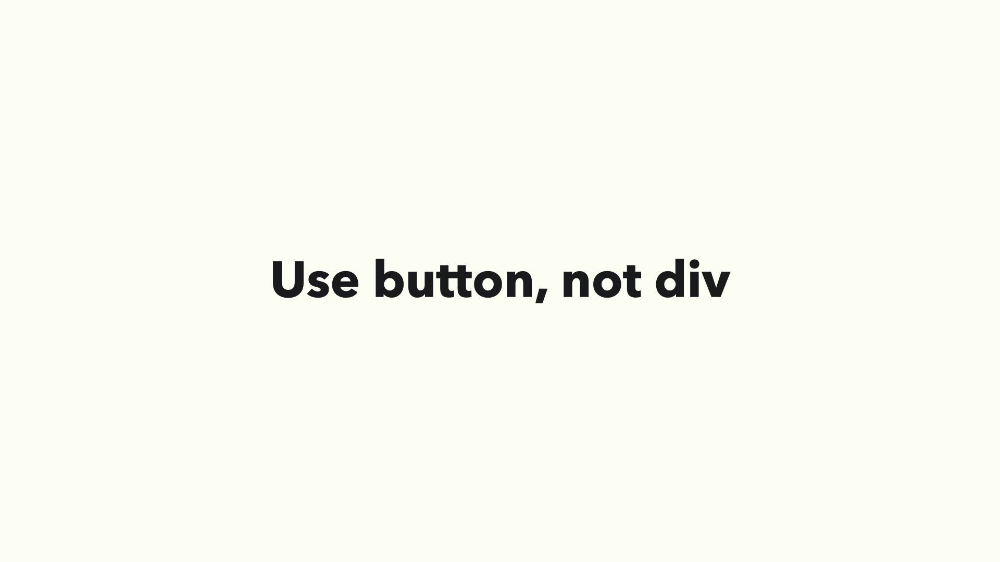
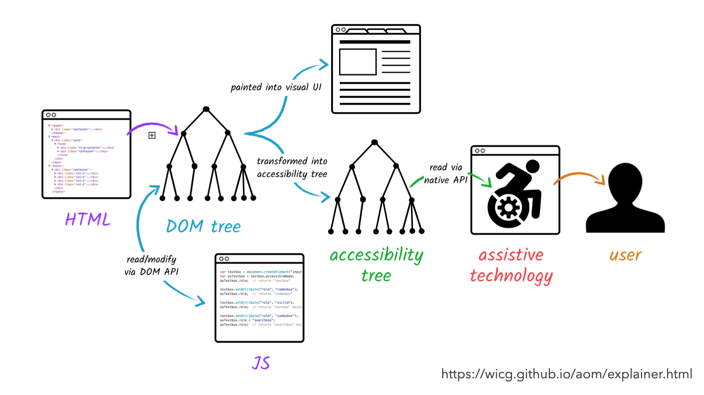
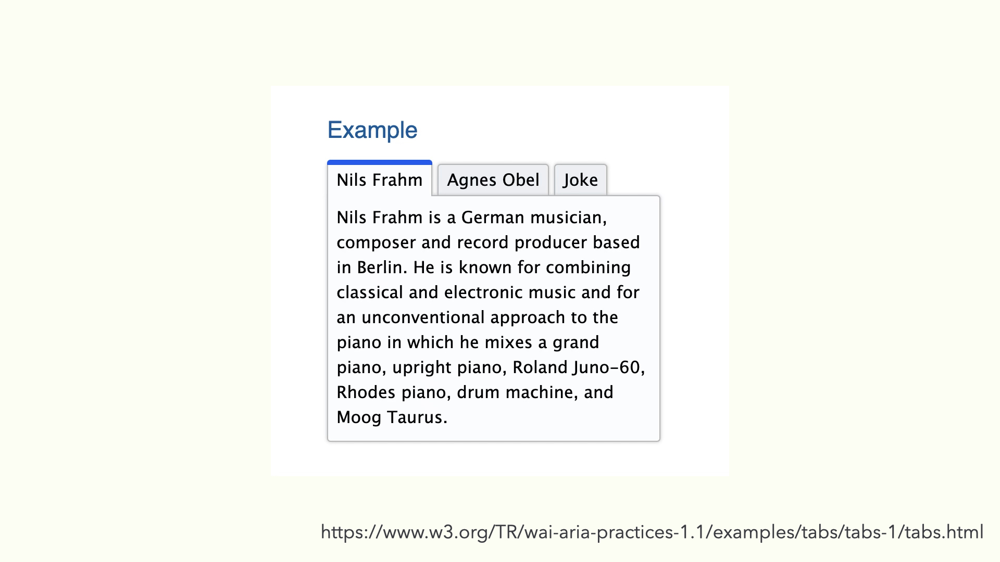

# これまでのアクセシビリティ対応

フロントエンド開発における、これまでのアクセシビリティ対応で重要なものは以下が挙げられます。

- セマンティックマークアップを忠実に
- HTML を正しく使う
- 複雑さは WAI-ARIA で補佐する

順に説明していきましょう。

## セマンティックマークアップを忠実に


`div` 要素や `span` 要素といったもので構築するのではなく、ナビゲーションとしてのものは `nav` 要素を使う、リストアイテム表示するのであれば `li` 要素を使うといった意味論的要素を扱うことが大事です。

セマンティックマークアップにおける恩恵は主にマシンリーダブルな点が挙げられます。

これにより支援技術に伝わるように変換できる、見出しなどはコンテンツ移動するためのインタフェースにもある、ページ検索ランキングの判定にも優位性がある、といったものが挙げられます。

このように機械側の解釈可能性をあげることは、めぐりめぐって人間にとっても使い勝手が向上するなど恩恵が受けられます。

## HTML を正しく使う


次に HTML を正しく使うことについて。これは前述したセマンティックマークアップにも通じる部分です。



アクセシビリティ界隈では有名になっている _Use button, not div_ というワードがあります。これはボタンとしての振る舞いがふさわしいときに `div` 要素ではなく `button` 要素で実装するほうを選びなさい、という話です。

ではなぜ `button` 要素を使うのかというと、HTML 上での意味論的要素でもあるのですが、ウェブブラウザ上で必要となるユースケースを補うことができます。

たとえばスタイルの定義もユーザエージェントのデフォルトスタイルで補えて、クリック制御やキーボード操作も JavaScript で特段指定しなくてもよくなります。適切なマークアップを提供しないとそうしたデフォルトのユースケースを補えなかったりします。

HTML を正しく使うためにはまずは実装したものをチェックしてみるのが大事です。

ブラウザの表示においては多少書き方が違ってもある程度補佐してくれたりしますが、静的解析で間違いを減らしていきましょう。

またスタイルを外したデフォルトの状態でも、意味がきちんと通るようになっているのとより良いでしょう。

## 複雑さは WAI-ARIA で補佐する


HTML だけで完結できるものがあれば良いのですが、複雑な UI をつくるにあたり、 **Web Accessibility Initiative – Accessible Rich Internet Applications**、通称 **WAI-ARIA** を用いる必要もあります。



支援技術に伝わる一連の流れとして、ブラウザから DOM ツリー・CSSのレンダリングを解析してアクセシビリティに関する情報をもつ アクセシビリティツリーに反映されます。

そして OS ごとのアクセシビリティ API を通じて支援技術をもってユーザーに情報が届きます。

WAI-ARIA は アクセシビリティツリーで認知できるように意味づけしてあげるという形です。



元はただのボタンとコンテンツだけだったものも、タブとそれに付随するタブパネルとして支援技術に通知することができます。これが WAI-ARIA がもつ役割です。

```html
<div class="tabs">
  <div role="tablist" aria-label="Entertainment">
    <button role="tab" aria-selected="true" aria-controls="nils-tab" id="nils">
      Nils Frahm
    </button>
    <button
      role="tab"
      aria-selected="false"
      aria-controls="agnes-tab"
      id="agnes"
      tabindex="-1"
    >
      Agnes Obel
    </button>
    <button
      role="tab"
      aria-selected="false"
      aria-controls="complexcomplex"
      id="complex"
      tabindex="-1"
      data-deletable=""
    >
      Joke
    </button>
  </div>
  <div tabindex="0" role="tabpanel" id="nils-tab" aria-labelledby="nils">
    <p>
      Nils Frahm is a German musician, composer and record producer based in
      Berlin. He is known for combining classical and electronic music and for
      an unconventional approach to the piano in which he mixes a grand piano,
      upright piano, Roland Juno-60, Rhodes piano, drum machine, and Moog
      Taurus.
    </p>
  </div>
  <div
    tabindex="0"
    role="tabpanel"
    id="agnes-tab"
    aria-labelledby="agnes"
    hidden=""
  >
    <p>
      Agnes Caroline Thaarup Obel is a Danish singer/songwriter. Her first
      album, Philharmonics, was released by PIAS Recordings on 4 October 2010 in
      Europe. Philharmonics was certified gold in June 2011 by the Belgian
      Entertainment Association (BEA) for sales of 10,000 Copies.
    </p>
  </div>
  <div
    tabindex="0"
    role="tabpanel"
    id="complexcomplex"
    aria-labelledby="complex"
    hidden=""
  >
    <p>Fear of complicated buildings:</p>
    <p>A complex complex complex.</p>
  </div>
</div>
```


ただし WAI-ARIA の誤った使用は逆にアクセシビリティを損なうことにも繋がります。

仕様では **「ARIA無しのほうが、悪いARIAよりも良い」** とも言われており、間違った使い方をしていないか WAI-ARIA の仕様を参照することを忘れないようにしましょう。