# これからのアクセシビリティ対応

前項ではこれまでの対応については紹介してきましたが、もう必要になったわけではなく引き続き念頭においておく内容です。それを踏まえた上で気をつけていきたいことを紹介できればと思います。

## UI の操作をできるようにする

ウェブブラウザ上でアプリケーションの操作が増えてきたことで UI に対しての制御管理も必要な事項になってきました。


たとえばフォーカスマネジメント。これはキーボード操作する上で注意すべき点になります。

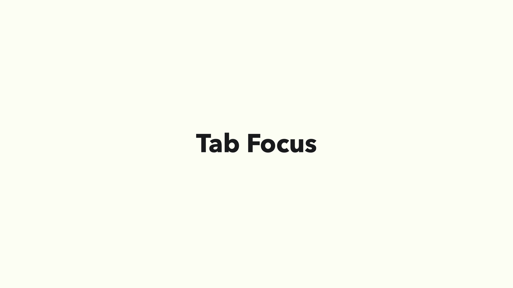

入力欄やボタンなどのフォーカスアウトラインを見えるようにするという前提がありますが、フォーカス順序が提供されているコンテンツの並びになっているかも気をつけたいところです。

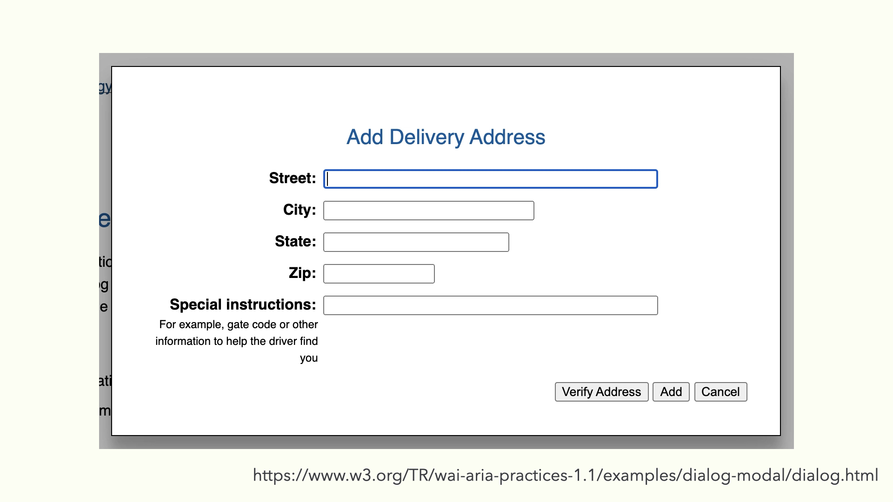

フォーカスマネジメントを考える上で「フォーカストラップ」という手法があります。これはフォーカスをとある領域からはみ出さないようにするものです。
フォーカス可能要素を抽出してその中をループするように実装することで実現できますが、URL バーのフォーカス移動が効かなくなる場合もあるので考慮もしておきたいところです。

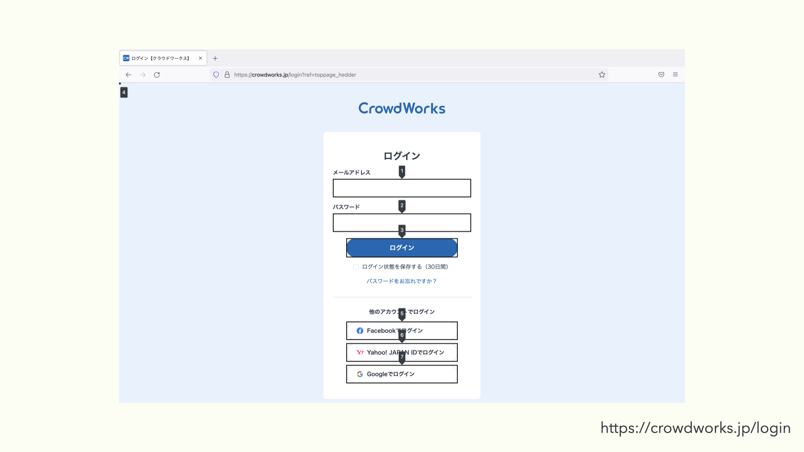

ちなみに Firefox の開発者ツールにあるアクセシビリティタブよりタブ順序を表示するという機能があります。これによりフォームの入力箇所やボタンなどのフォーカス順を確認することができるので、おかしな順序になっていないかも確認することができます。

## Sigle Page Application での留意

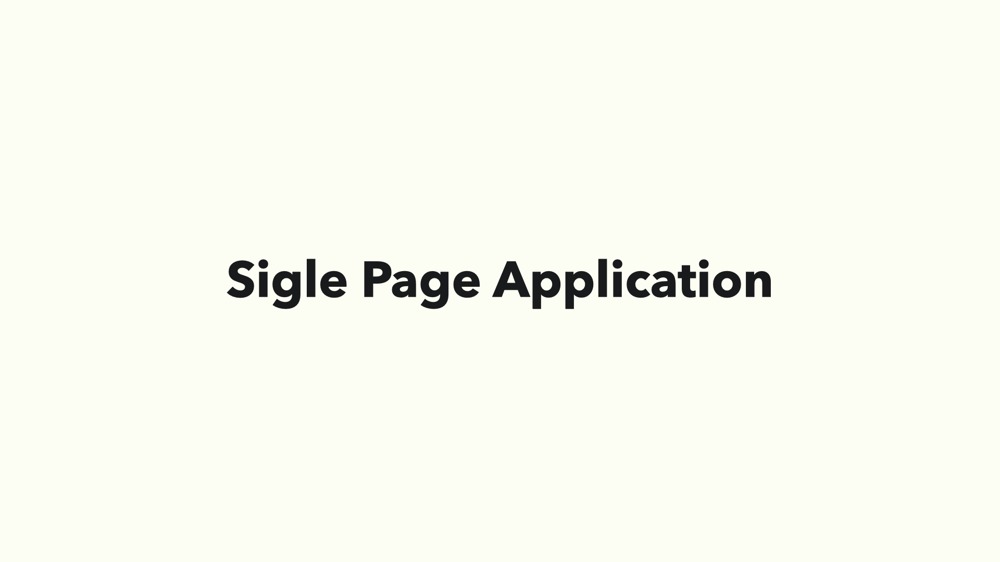

近年の Web アプリケーションの開発技術に Single Page Application、通称 SPA というアプリケーションの考え方が生まれました。

これは単一のウェブ文書のみを読み込み、サーバーから逐一読み込ませず JavaScript と Web API を用いて体験を向上させるアプリケーション開発です。


かつてはページに必要な情報はサーバーサイド側に持たせて、必要に応じてサーバーとのやりとりをするものでしたが、
フロントエンド側、つまりはブラウザ側だけでページにある状態を保持したり変化させることを担うことができるようになったとも言えます。


それでは「ページにある状態を変化させる」とは一体何かを説明したいと思います。
実際に動作するものを御覧ください。

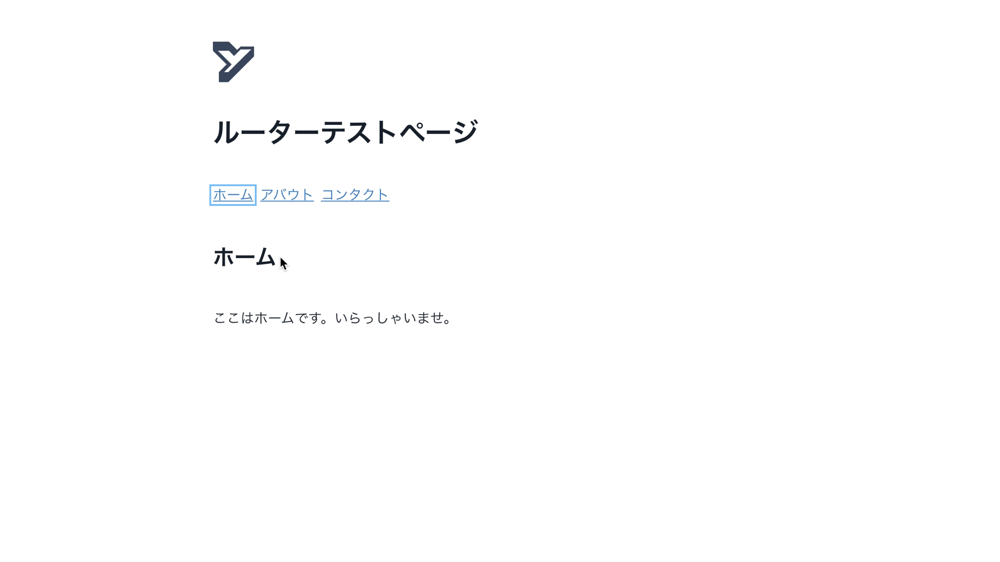

こちらは一見何の変哲もないページ遷移ですが、ルーターという技術を使って１ページ内なのにあたかも他のページに移動しているように見せる手段です。

見る分には特に違和感もないように見えます。
それでは、この内容をスクリーンリーダーという読み上げ機能で確認してみます。

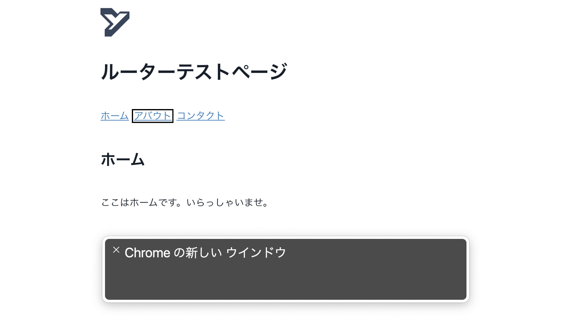

おや、これでおしまいでしょうか。もう一度確認してみましょう。

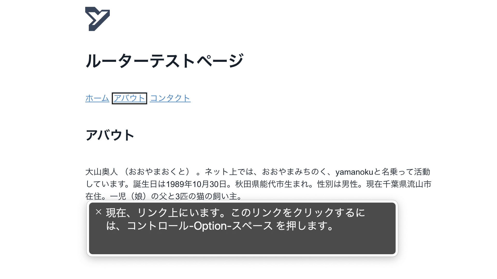

２度見てみましたが、ページの内容が変わっていることは何も伝わっていないようです。
これはスクリーンリーダー自体の問題ではなく、変化していることを適切に伝えていないために起きる問題です。

こういった事象では視覚的には問題なく見えていても支援技術にそれらを伝える手段がないため、一部のユーザーにとっては情報のギャップを生みかねないものになります。
それではどう解決していけばよいのでしょうか。

## ARIA ライブリージョンという手法


その解決する手段の１つとして ARIA ライブリージョンというものがあります。これはページ上にある変更を支援技術に通知するようにできる WAI-ARIA の１つで、先程の情報のギャップを埋めるに最適なものです。
そんな ARIA ライブリージョンについて各フロントエンドフレームワークでどう対応できているかを紹介してみます（2021 年 11 月 27 日登壇時点での内容）。

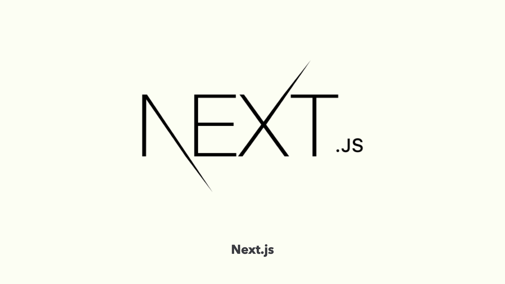

まずは Next.js の場合。

```javascript
const { asPath } = useRouter();
const [routeAnnouncement, setRouteAnnouncement] = React.useState("");
const initialPathLoaded = React.useRef(false);
React.useEffect(() => {
  if (!initialPathLoaded.current) {
    initialPathLoaded.current = true;
    return;
  }
  if (document.title) {
    setRouteAnnouncement(document.title);
  } else {
    const pageHeader = document.querySelector("h1");
    const content = pageHeader?.innerText ?? pageHeader?.textContent;
    setRouteAnnouncement(content || asPath);
  }
}, [asPath]);
```

`RouteAnnouncer` という形で提供されており、ページ変更の通知をすることができます。
最近までは先に大見出しを確認する形だったのですが、title を読み上げるように修正されて canary ブランチにマージされました。

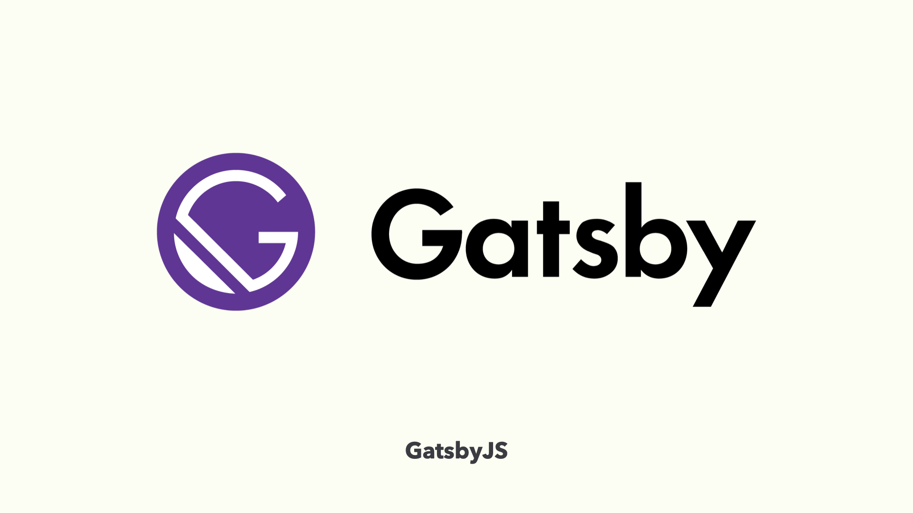

実は `RouteAnnouncer` は GatsbyJS で先に策定されたもので、かつて [@reach/router](https://reach.tech/router/) で実装されていたのですが問題があったため変更されたものになります。
ちなみに GatsbyJS は React.js のフレームワークの中でもアクセシビリティを推しているフレームワークでもあったりします。

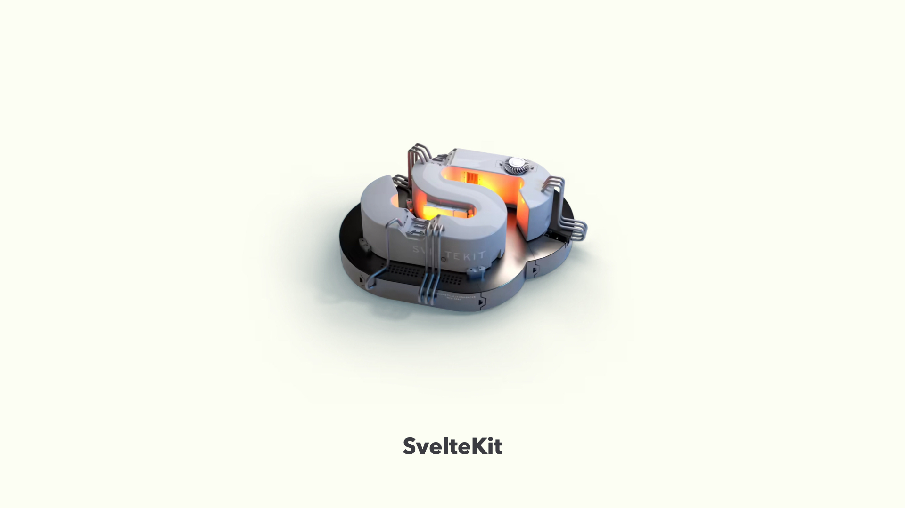

続いて Svelte アプリケーションフレームワークの SvelteKit について。

```html
{#if mounted}
<div id="svelte-announcer" aria-live="assertive" aria-atomic="true">
  {#if navigated} {title} {/if}
</div>
{/if}
```

こちらも GatsbyJS の `RouteAnnouncer` から着想を得た `svelte-announcer` というものが実装されています。
かつては「ナビゲート」という接頭辞が付けられていましたが、今は削除されています。

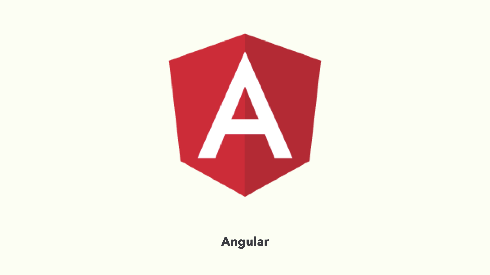

次は Angular について。

```html
<div *ngIf="title$ | async as title" aria-live="polite">
  <span [attr.aria-label]="title"></span>
</div>
```

app.component.html 上に AsyncPipe を用いることで title 情報を ARIA ライブリージョンにより伝播することが可能になります。
コード上では aria-label で title が伝わるようになっていますが、視覚的にだけ隠す手段を用いてみても良さそうです。

```javascript
@Component({
  selector: "app-component"
  providers: [LiveAnnouncer]
})
export class AppComponent {
 constructor(liveAnnouncer: LiveAnnouncer) {
   liveAnnouncer.announce("live region!");
  }
}
```

また、@angular/cdk/a11y の中には LiveAnnouncer というものもありこちらでも読み上げ対応ができそうです。


最後に Vue.js に関して。

```javascript
{
  name: 'home',
  path: '/',
  component: Home,
  meta: {
    announcer: { // vue-announcer settings
      message: 'ホーム画面'
    }
  }
}
```

vue-announcer というライブラリを使用する形で vue-router と組み合わせて使うことができます。設定で skip することもできたり、読み込み後に文字を追加することもできます。

それでは実際に修正を行ったものを見てみましょう。

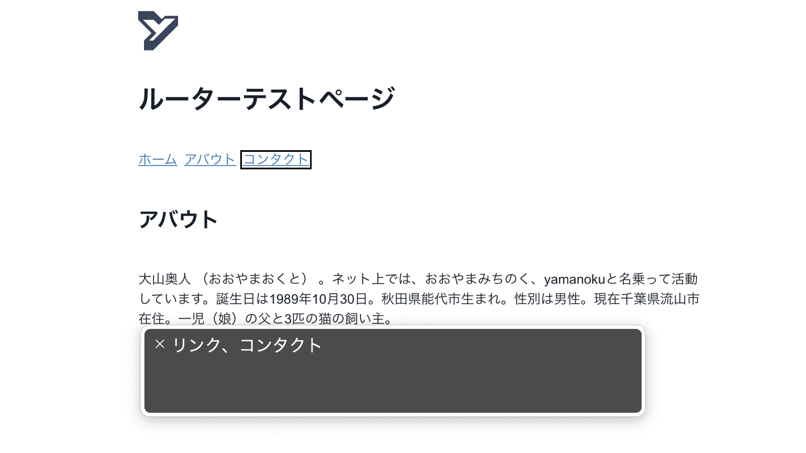

これで通知することができました。ページ遷移のほかフォームのアラートだったりトースト UI のような動的に変化させるものがあれば、支援技術にも通知できているかを意識してみるといいでしょう。

## 通知における留意点


状態を通知する方法について紹介しましたが、通知に関する留意点についても学びましょう。

通知は都度ユーザに伝えるようにしてしまうとユーザ体験を損ねます。これはページ遷移だけではなくあらゆる通知についても同様です。

一から実装する際には動作が完了してから読み上げてくれる `aria-live=“polite”` で基本行うようにして、緊急性の高いものは `assertive` や `role=“alert”` などで通知するようにしましょう。
