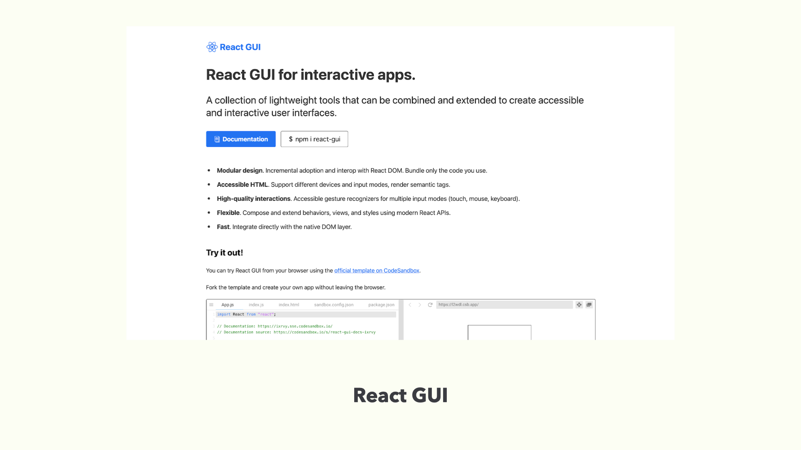
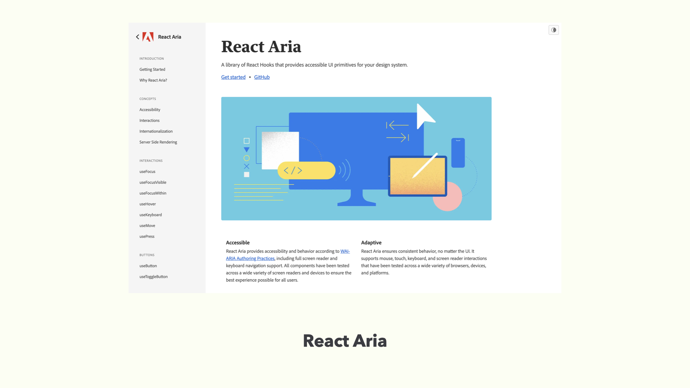
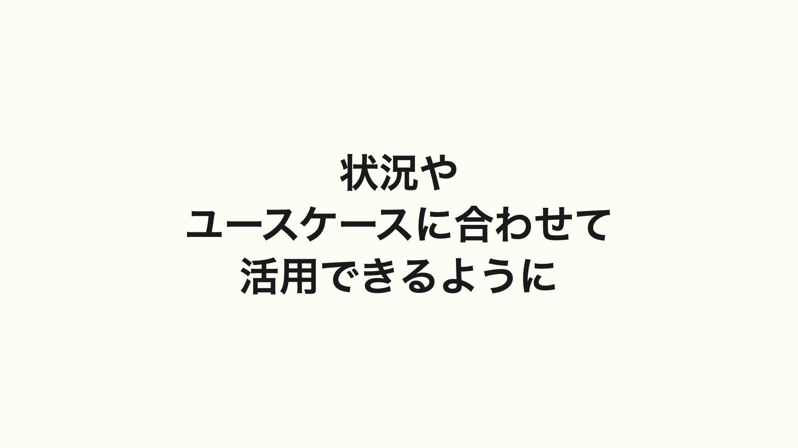

# 期待するアプローチ


2021 年ウェブ界隈で大きなニュースでもあった Internet Explorer 11 のサポート終了の発表があり、今後はレガシーブラウザの考慮が減り先進的なウェブ標準による開発機運が高まってきました。

## HTML による UI 実装の限界


ところで先進的なウェブ開発をするにあたり一旦立ち止まって考えてみてほしいことがあります。ブラウザはあくまでもドキュメントビュワーのものであるということです。


ポートフォリオサイトやコーポレイトサイト、あるいはサーバーサイドと連携した販売サイトなど。インターネットを通じてそれらの文書を見ることができるようになっています。CSS で色付けされたり JavaScript で動的にすることで印象が離れがちですが、ハイパーテキストシステムのコンテンツのために HTML は存在しています。


それでは HTML は GUI のための機能を備えていると思えますでしょうか。HTML ５へ進化した中で表現も豊かにインタラクションもですが、アプリケーションのものとして使えるパーツとしてはまだ不十分、満たせていないと思います。多くは CSS や JavaScript と組み合わせてあたかも存在しているような UI と錯覚してるにすぎません。


以前私は「HTML だけで UI を作る限界」と題した、ユーザの要求が変化していく中、その複雑さを受け入れるアプリケーションをつくるために、今ある HTML を使い続けるのは限界があるのではないか、といった内容を発表しました。
そんな中で私がまさに、という期待しうるアプローチが今年になって発表されていました。

## React GUI



Normalize.css 作者でもある Nicolas により発表された React GUI です。

これは何かというと、もともとネイティブアプリケーション用に使われている React Native を GUI パーツそのものとして Web ブラウザ側でも使えるようにもってこれるようにしたライブラリになります。HTML の UI パーツから実装を考えるのではなく、アプリケーションのものとして使われる GUI をもとに実装をしていくというアプローチです。
React GUI をプロダクションコードで使用している例はまだ見つけられてませんが、前身でもある React Native for Web は Web 版の Twitter で使用されています。

## デザインシステムからのアプローチ

次は「デザインシステム」という考え方から着想を得た２つのアプローチについて紹介します。


１つは Headless UI です。
これはスタイルを考慮していないコンポーネントでざっくりというと挙動のみが提供されているものです。スタイルは TailwindCSS など別に付与することができます。React.js と Vue3 向けに提供されています。



もう１つは React Aria です。
Adobe が開発するデザインシステムの「React Spectrum」で、UI としての挙動やアクセシビリティ実装を React Hooks で分離して管理できるようになっています。こちらは React.js のみの対応になっています。

これらのアプローチに共通することは JavaScript に振る舞いを集約させていることです。

以下のコードの例ではこれまで属性や疑似要素のように扱っていた挙動を React Hooks から抽出してスタイルで制御するようにしています。

```javascript
let { buttonProps, isPressed } = useButton(props, ref);
let { focusProps, isFocusVisible } = useFocusRing();
let className = classNames(
  props.isDisabled ? "bg-gray-400" : isPressed ? "bg-blue-700" : "bg-blue-500",
  "text-white",
  "font-bold",
  "py-2",
  "px-4",
  "rounded",
  "cursor-default",
  "focus:outline-none",
  isFocusVisible ? "shadow-outline" : "",
  "transition",
  "ease-in-out",
  "duration-150"
);
```

数値入力フィールドもこのように Hooks を使いこなすことで表現可能になっています。個人的な意見となりますが、ここまで多様な考慮がされている input type=“number” は他にはないんじゃないかなと思っています。

```javascript
function NumberField(props) {
  let { locale } = useLocale();
  let state = useNumberFieldState({ ...props, locale });
  let inputRef = React.useRef();
  let incrRef = React.useRef();
  let decRef = React.useRef();
  let {
    labelProps,
    groupProps,
    inputProps,
    incrementButtonProps,
    decrementButtonProps,
  } = useNumberField(props, state, inputRef);
  let { buttonProps: incrementProps } = useButton(
    incrementButtonProps,
    incrRef
  );
  let { buttonProps: decrementProps } = useButton(decrementButtonProps, decRef);
  return (
    <div>
      <label {...labelProps}>{props.label}</label>
      <div {...groupProps}>
        <button {...decrementProps} ref={incrRef}>
          -
        </button>
        <input {...inputProps} ref={inputRef} />
        <button {...incrementProps} ref={decRef}>
          +
        </button>
      </div>
    </div>
  );
}
```

こうした JavaScript から振る舞いを定義していくことはネイティブでは足りなかったユースケースを創造していくことにもつながります。

## WebComponents と AOM

HTML にはなかったものをつくる、という観点では Web Components の要素でもある Custom Elements も挙げられます。


JavaScript を用いて読み込ませることで、たとえば toggle-button という HTML 上には存在しない Custom Elements を存在させることができます。

実装としてはコード例にあるとおりで toggle-button という要素を表示できるようになります。

```javascript
class ToggleButton extends HTMLElement {
  connectedCallback() {
    this.setAttribute("role", "button");
    this.setAttribute("aria-pressed", "false");
    this.addEventListener("click", togglePressed);
    this.addEventListener("keydown", function (event) {
      if (event.key === "Enter" || event.key === "Space") {
       togglePressed();
      }
    });
  }
}

customElements.define("toggle-button", ToggleButton);
```

ですが、この手法での欠点として DOM に WAI-ARIA 属性が露出してしまう問題があります。デフォルトで暗黙のセマンティクスがある button といった純粋な HTML 要素にはこういったものは現れません。

```html
<toggle-button role="button" aria-pressed="false">
  Toggle
</toggle-button>

<button>
  Default Button
</button>
```


この欠点を解消する１つの手法として、アクセシビリティのためのユースケースとして開発されている Accessibility Object Model 、通称 AOM という JavaScript API でのアプローチがあります。

かつては属性値で設定する必要があったものが、IDL 属性に文字列や真偽値で挿入することができるようになります。つまりこれはアクセシビリティとしての関心事を DOM から分離して管理できるようになります。

```javascript
class ToggleButton extends HTMLElement {
  constructor() {
    super();
    this._internals = this.attachInternals();
    this._internals.role = "button";
    this._internals.ariaPressed = false;
  }
}

ToggleButton.addEventListener("keydown", (event) => {
  if (event.key === "Enter" || event.key === "Space") {
    toggleButton();
  }
});

customElements.define("toggle-button", ToggleButton);
```

こうすることで toggle-button に暗黙のセマンティクスを定義できるようになり、DOM 上からはその情報を露呈させなくてもよくなります。

```html
<toggle-button>
  Toggle
</toggle-button>

<button>
  Default Button
</button>
```

このように自分たちで１つずつ定義していくアプローチも存在します。これは自分たちで Web 標準のものを生み出すようなストイックな手法で安易にオススメはできません。ですが、Shadow DOM にスタイルを内包させて、各種フロントエンドフレームワークとも合わせて使えるアプローチでもあります。

---


以上いくつかのアプローチを紹介させていただきましたが、これらのアプローチはプロダクトレディではなかったり、フレームワーク固定であったり、AOM はすべてのブラウザで安定して使用できるものでもないため、銀の弾丸となるものではないのは注意いただければと思います。



しかしながら、これまでのアクセシビリティを考慮するフロントエンド開発とは違って、責務を分割して柔軟に扱えるようにするアプローチであることは変わりないので、今後もこれらの動向を追いつつ、各開発状況やプロダクトのユースケースに合わせて活用できるようにしていきたいですね。
