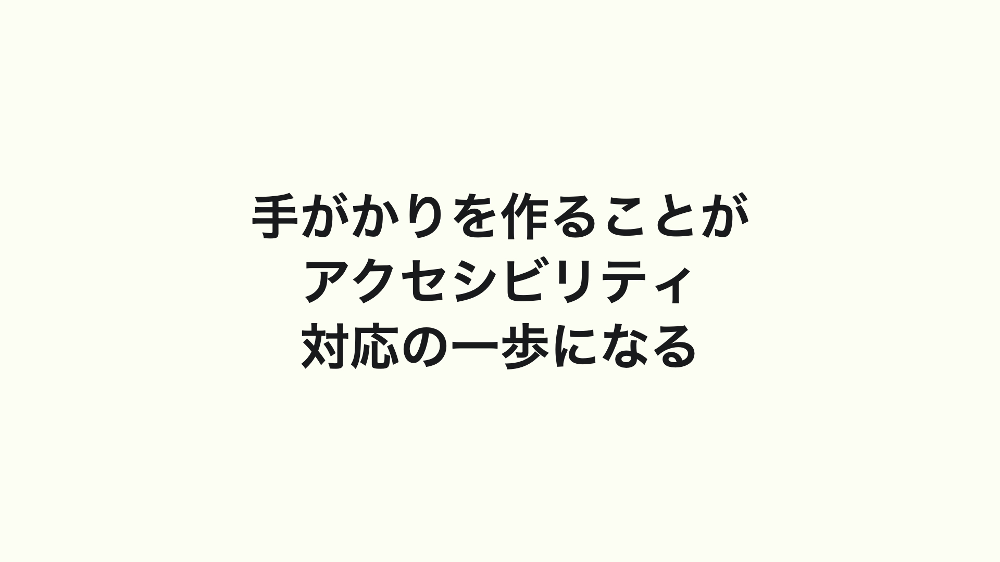

# おわりに

フロントエンド開発におけるこれまでとこれからのアクセシビリティ対応についてを紹介させてもらいました。最後に私から皆さんにアクセシビリティ対応をはじめられるヒントをお教えできればと思います。

W3C が提唱しているウェブアクセシビリティのガイドライン、通称 Web Content Accessibility Guidelines において、ウェブアクセシビリティの４つの原則というものがあります。

その４原則とは「知覚可能」、「操作可能」、「理解可能」、そして「堅牢」であるというものです。

わたしはこの「知覚可能」という考え方が、アクセシビリティ対応をやる意義として分かりやすいものではないかなと思います。

知覚できるようにする、ということはどういうことでしょうか。

それは感覚器官を用いて触ることができるものをつくるということです。
ブラウザ上からは視覚的に情報に触れ、聴覚で音に触れ、キーボードを通じて触覚において画面上の存在に触れることができます。

触れることができるということは即ちそこに何かがあるということに気付くことができます。

誰にでも問題なく動かせるものを作るというのは途方もなく大変なことです。ただ、そこに何かがあることに気づくことができる、ということができるだけでもアクセシビリティ対応の一歩になるのではないかと私は思います。

アクセシビリティについて真面目に取り組めば取り組むほど、０か１かの話じゃないことが分かってきます。人の数だけユースケースは増えていきます。
どこかで達成した１００％ものが延々と残り続けることはないのです。

だからこそ、様々な人たちが触れるものを作っていき、

そして、私たちがつくるものにあらゆる人が参加できるようになるために、アクセシブルなフロントエンド開発をやっていきましょう。

これまでやってきた人も、そして、今日これからやっていく人も。
