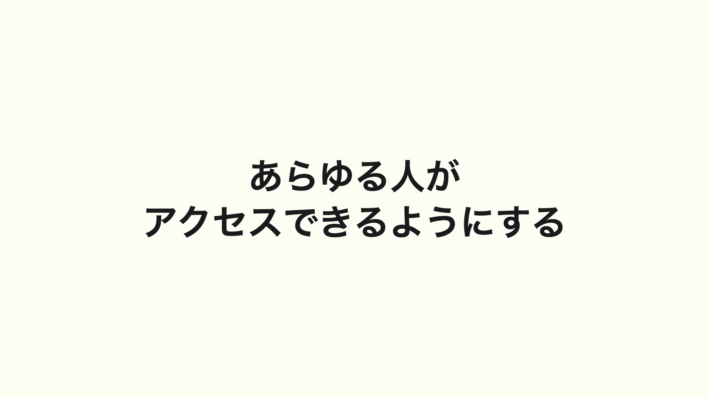
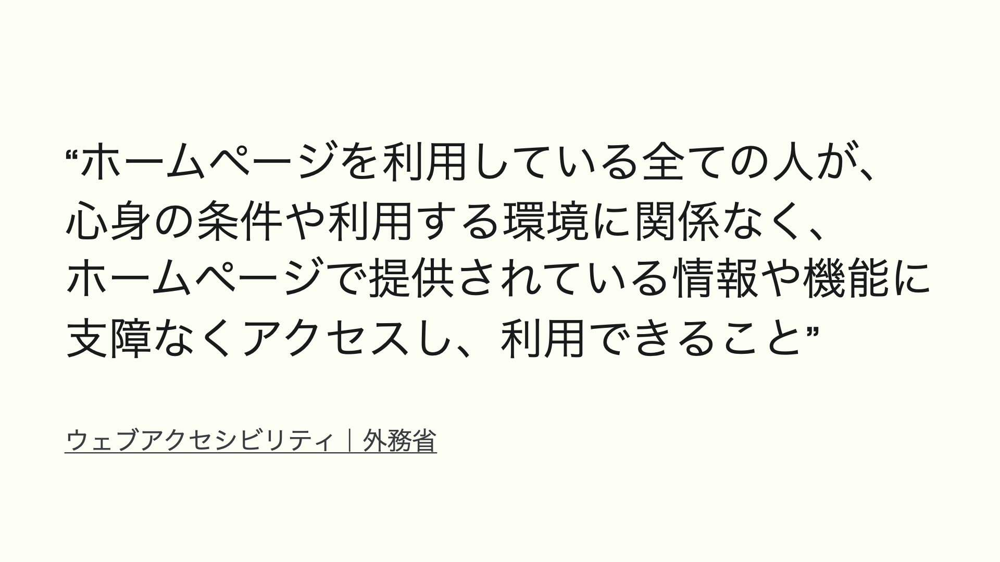
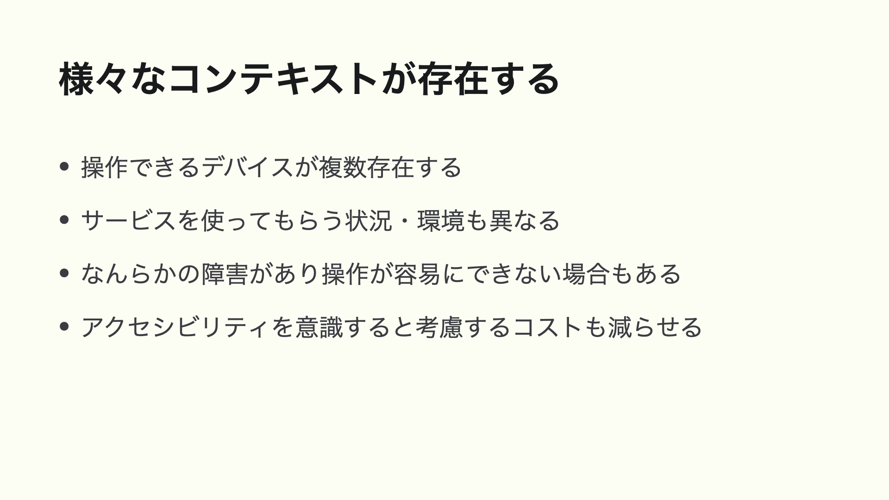
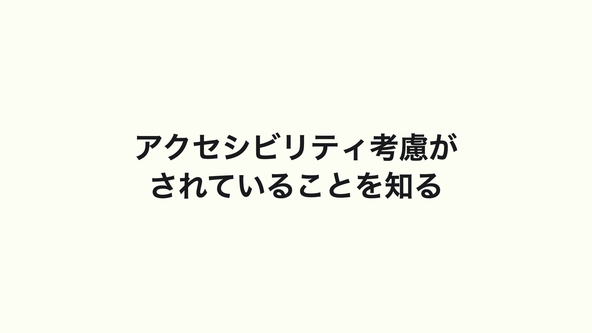
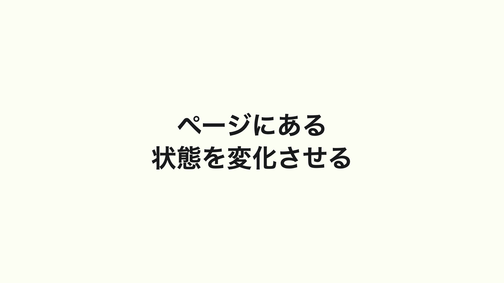
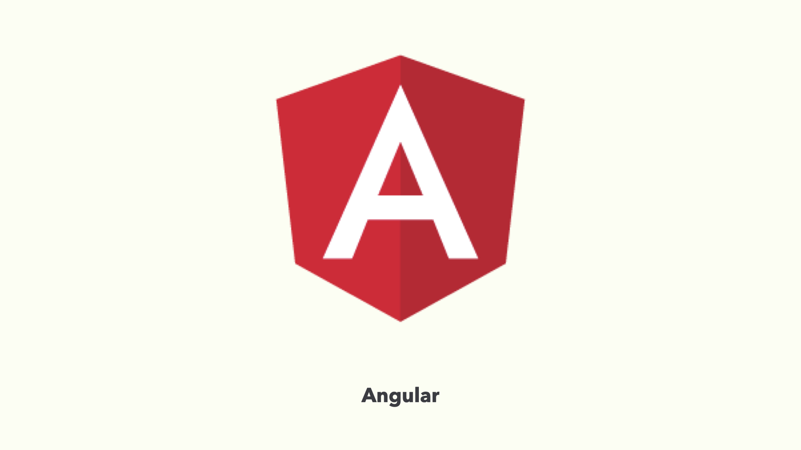

2021年11月27日に開催された [JS ConfJP 2021](https://jsconf.jp/2021/) にて登壇してきました。このページはそこで登壇した内容をもとに書き起こした記事です。

## アクセシビリティとは何か


フロントエンド開発をしている人であれば「アクセシビリティ」という言葉は耳にしたことがあると思います。

では、アクセシビリティとは一体何を意味する言葉なのでしょう。



アクセシビリティはあらゆる人がアクセスできるようになることを指します。

アクセスする、というと想像しづらいのですが、なんらかの情報を得られるようになる、とある機器やサービスを利用できるようになると言い換えるとイメージしやすいかもしれません。


では「ウェブアクセシビリティ」とは何でしょうか。



外務省の定義として _「ホームページを利用している全ての人が、心身の条件や利用する環境に関係なく、ホームページで提供されている情報や機能に支障なくアクセスし、利用できること」_ と書かれています。

ホームページというと個人のウェブサイトがイメージするかもしれませんが、ウェブブラウザ上で表示できるページのことを指していると解釈しています。


そもそもウェブとアクセシビリティはどういう関係があるのでしょうか。

ウェブの概念を提唱したティム・バーナーズ＝リー氏は _「ウェブのパワーは、その普遍性にある。障害の有無に関係なく、誰もが使えることが、その本質である」_ と説いています。


つまり、ウェブはもともとアクセシビリティが兼ね揃えたものであり、ウェブ上で仕事をする我々はアクセシビリティを享受・提供できているといっても差し支えありません。

事実、インターネットの環境が整っていれば「いつでも、どこでも、誰でも」アクセスすることができるのですから。


そんなウェブがもつアクセシビリティを守ることにはどういった恩恵があるでしょうか。
１つあるのが多様なユーザ層への考慮です。



かつてはデスクトップだけでウェブに触れていたものが、スマートフォンやタブレットといった機器が増えてきました。

使用する状況も室内や室外、それぞれでユースケースは異なってきます。なんらかの状況によって操作が容易ではなくなることもあるかもしれません。

ウェブ標準のものを意識することでアクセシビリティへの考慮コストもいくつか減らすことができます。


結果として多くのプロダクトやサービスを使う利用者層も獲得できて、分母の母数を増やすことにも繋がり、ビジネス面において貢献できる期待がもてます。


多様なユーザや多様なデバイスでアクセスできるようになるということは、言い換えれば一人ひとりがアクセスできるということでもあります。


デザインの領域でもアクセシビリティの考え方は活用することができます。

それは、感覚に寄らない「根拠のあるデザイン」をつくることです。


私の[ポートフォリオサイト](https://yamanoku.net)ではメインコンテンツの最大幅を文字サイズになるように設定しています。

これは視覚的提示するものをあらゆる人が読みやすくするための考慮のためでもあります。

アクセシビリティを根拠として設計することで万人にとっても理解しやすいきっかけにもなります。


また、日本とアクセシビリティに関連することとして、今年６月より民間企業への合理的配慮の提供を義務づけるように改正障害者差別解消法が交付されたことがあります。


**合理的配慮**とは、障害がある人のために負担が重すぎない範囲で社会的にバリアとなっているものを事業者がなくす対応のことです。これまで行政は対応必須となっていましたが、民間でもその対応が努力義務から義務化されました。


そんな中、ウェブアクセシビリティを含む情報アクセシビリティは、合理的配慮を的確に行うための環境の整備と位置づけられており、事前的改善措置として計画的に推進することが求められています。

サービス上で合理的配慮をするにあたり、だれでも行えるようにするための開発が「環境の整備」とも言えます。

今後、デジタル庁が主体となって情報アクセシビリティの保証が強くなってといいと感じています。



ウェブアクセシビリティは環境の整備と紹介しましたが、それらが考慮されているホームページはどういったものがあるか気になるところです。


日本のみなさんであればご存知かもしれない[東京都新型コロナウイルス感染症対策サイト](https://stopcovid19.metro.tokyo.lg.jp/)はアクセシビリティ考慮がされているサイトでもあります。

行政機関のホームページとして位置づけられているため、比較的厳格な基準でのウェブアクセシビリティの試験が実施され、その試験がパスされて準拠したという結果も発表されています。

ちなみにこのサイトは [Nuxt.js](https://nuxtjs.org/) で構築されており、[Vue.js](https://jp.vuejs.org/index.html) を使用した日本でもっともアクセシビリティが重視されたサイトと言ってもいいかも知れません。

## これまでのアクセシビリティ対応

フロントエンド開発における、これまでのアクセシビリティ対応で重要なものは以下が挙げられます。

- セマンティックマークアップを忠実に
- HTML を正しく使う
- 複雑さは WAI-ARIA で補佐する

順に説明していきましょう。

### セマンティックマークアップを忠実に


`div` 要素や `span` 要素といったもので構築するのではなく、ナビゲーションとしてのものは `nav` 要素を使う、リストアイテム表示するのであれば `li` 要素を使うといった意味論的要素を扱うことが大事です。

セマンティックマークアップにおける恩恵は主にマシンリーダブルな点が挙げられます。

これにより支援技術に伝わるように変換できる、見出しなどはコンテンツ移動するためのインタフェースにもある、ページ検索ランキングの判定にも優位性がある、といったものが挙げられます。

このように機械側の解釈可能性をあげることは、めぐりめぐって人間にとっても使い勝手が向上するなど恩恵が受けられます。

### HTML を正しく使う


次に HTML を正しく使うことについて。これは前述したセマンティックマークアップにも通じる部分です。


アクセシビリティ界隈では有名になっている _Use button, not div_ というワードがあります。これはボタンとしての振る舞いがふさわしいときに `div` 要素ではなく `button` 要素で実装するほうを選びなさい、という話です。

ではなぜ `button` 要素を使うのかというと、HTML 上での意味論的要素でもあるのですが、ウェブブラウザ上で必要となるユースケースを補うことができます。

たとえばスタイルの定義もユーザエージェントのデフォルトスタイルで補えて、クリック制御やキーボード操作も JavaScript で特段指定しなくてもよくなります。適切なマークアップを提供しないとそうしたデフォルトのユースケースを補えなかったりします。

HTML を正しく使うためにはまずは実装したものをチェックしてみるのが大事です。

ブラウザの表示においては多少書き方が違ってもある程度補佐してくれたりしますが、静的解析で間違いを減らしていきましょう。

またスタイルを外したデフォルトの状態でも、意味がきちんと通るようになっているのとより良いでしょう。

### 複雑さは WAI-ARIA で補佐する


HTML だけで完結できるものがあれば良いのですが、複雑な UI をつくるにあたり、 **Web Accessibility Initiative – Accessible Rich Internet Applications**、通称 **WAI-ARIA** を用いる必要もあります。


支援技術に伝わる一連の流れとして、ブラウザから DOM ツリー・CSSのレンダリングを解析してアクセシビリティに関する情報をもつ アクセシビリティツリーに反映されます。

そして OS ごとのアクセシビリティ API を通じて支援技術をもってユーザーに情報が届きます。

WAI-ARIA は アクセシビリティツリーで認知できるように意味づけしてあげるという形です。


元はただのボタンとコンテンツだけだったものも、タブとそれに付随するタブパネルとして支援技術に通知することができます。これが WAI-ARIA がもつ役割です。

```html
<div class="tabs">
  <div role="tablist" aria-label="Entertainment">
    <button role="tab" aria-selected="true" aria-controls="nils-tab" id="nils">
      Nils Frahm
    </button>
    <button
      role="tab"
      aria-selected="false"
      aria-controls="agnes-tab"
      id="agnes"
      tabindex="-1"
    >
      Agnes Obel
    </button>
    <button
      role="tab"
      aria-selected="false"
      aria-controls="complexcomplex"
      id="complex"
      tabindex="-1"
      data-deletable=""
    >
      Joke
    </button>
  </div>
  <div tabindex="0" role="tabpanel" id="nils-tab" aria-labelledby="nils">
    <p>
      Nils Frahm is a German musician, composer and record producer based in
      Berlin. He is known for combining classical and electronic music and for
      an unconventional approach to the piano in which he mixes a grand piano,
      upright piano, Roland Juno-60, Rhodes piano, drum machine, and Moog
      Taurus.
    </p>
  </div>
  <div
    tabindex="0"
    role="tabpanel"
    id="agnes-tab"
    aria-labelledby="agnes"
    hidden=""
  >
    <p>
      Agnes Caroline Thaarup Obel is a Danish singer/songwriter. Her first
      album, Philharmonics, was released by PIAS Recordings on 4 October 2010 in
      Europe. Philharmonics was certified gold in June 2011 by the Belgian
      Entertainment Association (BEA) for sales of 10,000 Copies.
    </p>
  </div>
  <div
    tabindex="0"
    role="tabpanel"
    id="complexcomplex"
    aria-labelledby="complex"
    hidden=""
  >
    <p>Fear of complicated buildings:</p>
    <p>A complex complex complex.</p>
  </div>
</div>
```


ただし WAI-ARIA の誤った使用は逆にアクセシビリティを損なうことにも繋がります。

仕様では **「ARIA無しのほうが、悪いARIAよりも良い」** とも言われており、間違った使い方をしていないか WAI-ARIA の仕様を参照することを忘れないようにしましょう。

## これからのアクセシビリティ対応

前項ではこれまでの対応については紹介してきましたが、もう必要になったわけではなく引き続き念頭においておく内容です。

それを踏まえた上で気をつけていきたいことを紹介できればと思います。

### UI の操作をできるようにする

ウェブブラウザ上でアプリケーションの操作が増えてきたことで UI に対しての制御管理も必要な事項になってきました。


たとえばフォーカスマネジメント。これはキーボード操作する上で注意すべき点になります。


入力欄やボタンなどのフォーカスアウトラインを見えるようにするという前提がありますが、フォーカス順序が提供されているコンテンツの並びになっているかも気をつけたいところです。


フォーカスマネジメントを考える上で「フォーカストラップ」という手法があります。これはフォーカスをとある領域からはみ出さないようにするものです。

フォーカス可能要素を抽出してその中をループするように実装することで実現できますが、URL バーのフォーカス移動が効かなくなる場合もあるので考慮もしておきたいところです。


ちなみに Firefox の開発者ツールにあるアクセシビリティタブよりタブ順序を表示するという機能があります。

これによりフォームの入力箇所やボタンなどのフォーカス順を確認することができるので、おかしな順序になっていないかも確認することができます。

### Sigle Page Application での留意


近年の Web アプリケーションの開発技術に **Single Page Application**、通称 **SPA** というアプリケーションの考え方が生まれました。

これは単一のウェブ文書のみを読み込み、サーバーから逐一読み込ませず JavaScript と Web API を用いて体験を向上させるアプリケーション開発です。


かつてはページに必要な情報はサーバーサイド側に持たせて、必要に応じてサーバーとのやりとりをするものでしたが、フロントエンド側、つまりはブラウザ側だけでページにある状態を保持したり変化させることを担うことができるようになったとも言えます。



それでは「ページにある状態を変化させる」とは一体何かを説明したいと思います。

実際に動作するものを御覧ください。


こちらは一見何の変哲もないページ遷移ですが、ルーターという技術を使って１ページ内なのにあたかも他のページに移動しているように見せる手段です。

見る分には特に違和感もないように見えます。

それでは、この内容をスクリーンリーダーという読み上げ機能で確認してみます。

<video src="../videos/voice-over-sample-01.mp4" controls style="width: 100%; border: 1px solid var(--y-image-border-color);"></video>

おや、これでおしまいでしょうか。もう一度確認してみましょう。

<video src="../videos/voice-over-sample-02.mp4" controls style="width: 100%; border: 1px solid var(--y-image-border-color);"></video>

２度見てみましたが、ページの内容が変わっていることは何も伝わっていないようです。

これはスクリーンリーダー自体の問題ではなく、変化していることを適切に伝えていないために起きる問題です。

こういった事象では視覚的には問題なく見えていても支援技術にそれらを伝える手段がないため、一部のユーザーにとっては情報のギャップを生みかねないものになります。

それではどう解決していけばよいのでしょうか。

### ARIA ライブリージョンという手法


その解決する手段の１つとして ARIA ライブリージョンというものがあります。これはページ上にある変更を支援技術に通知するようにできる WAI-ARIA の１つで、先程の情報のギャップを埋めるに最適なものです。

そんな ARIA ライブリージョンについて各フロントエンドフレームワークでどう対応できているかを紹介してみます（注：2021 年 11 月 27 日登壇時点での内容）。


まずは [Next.js](https://nextjs.org/) の場合。

```javascript
const { asPath } = useRouter();
const [routeAnnouncement, setRouteAnnouncement] = React.useState("");
const initialPathLoaded = React.useRef(false);
React.useEffect(() => {
  if (!initialPathLoaded.current) {
    initialPathLoaded.current = true;
    return;
  }
  if (document.title) {
    setRouteAnnouncement(document.title);
  } else {
    const pageHeader = document.querySelector("h1");
    const content = pageHeader?.innerText ?? pageHeader?.textContent;
    setRouteAnnouncement(content || asPath);
  }
}, [asPath]);
```

`RouteAnnouncer` という形で提供されており、ページ変更の通知をすることができます。

最近までは先に大見出しを確認する形だったのですが、`<title>` を読み上げるように修正されて canary ブランチにマージされました。


実は `RouteAnnouncer` は [GatsbyJS](https://www.gatsbyjs.com/) で先に策定されたもので、かつて [@reach/router](https://reach.tech/router/) で実装されていたのですが問題があったため変更されたものになります。

ちなみに GatsbyJS は React.js のフレームワークの中でもアクセシビリティを推しているフレームワークでもあったりします。


続いて Svelte アプリケーションフレームワークの [SvelteKit](https://kit.svelte.dev/) について。

```html
{#if mounted}
<div id="svelte-announcer" aria-live="assertive" aria-atomic="true">
  {#if navigated} {title} {/if}
</div>
{/if}
```

こちらも GatsbyJS の `RouteAnnouncer` から着想を得た `svelte-announcer` というものが実装されています。

かつては「ナビゲート」という接頭辞が付けられていましたが、今は削除されています。



次は [Angular](https://angular.io/) について。

```html
<div *ngIf="title$ | async as title" aria-live="polite">
  <span [attr.aria-label]="title"></span>
</div>
```

`app.component.html` 上に `AsyncPipe` を用いることで `<title>` 情報を ARIA ライブリージョンにより伝播することが可能になります。

コード上では `aria-label` で `<title>` が伝わるようになっていますが、視覚的にだけ隠す手段を用いてみても良さそうです。

```javascript
@Component({
  selector: "app-component"
  providers: [LiveAnnouncer]
})
export class AppComponent {
 constructor(liveAnnouncer: LiveAnnouncer) {
   liveAnnouncer.announce("live region!");
  }
}
```

また、[@angular/cdk/a11y](https://material.angular.io/cdk/a11y/api) の中には `LiveAnnouncer` というものもありこちらでも読み上げ対応ができそうです。


最後に [Vue.js](https://vuejs.org/index.html) に関して。

```javascript
{
  name: 'home',
  path: '/',
  component: Home,
  meta: {
    announcer: { // vue-announcer settings
      message: 'ホーム画面'
    }
  }
}
```

[vue-announcer](https://github.com/vue-a11y/vue-announcer/tree/5c43a479dd0b390a4c4a0b7ade285128efa7c6af) というライブラリを使用する形で [vue-router](https://router.vuejs.org/) と組み合わせて使うことができます。設定で `skip` にすることもできたり、読み込み後に文字を追加することもできます。

それでは実際に修正を行ったものを見てみましょう。

<video src="../videos/voice-over-sample-03.mp4" controls style="width: 100%; border: 1px solid var(--y-image-border-color);"></video>

これで通知することができました。

ページ遷移のほかフォームのアラートだったりトースト UI のような動的に変化させるものがあれば、支援技術にも通知できているかを意識してみるといいでしょう。

### 通知における留意点


状態を通知する方法について紹介しましたが、通知に関する留意点についても学びましょう。

通知は都度ユーザに伝えるようにしてしまうとユーザ体験を損ねます。これはページ遷移だけではなくあらゆる通知についても同様です。

一から実装する際には動作が完了してから読み上げてくれる `aria-live=“polite”` で基本行うようにして、緊急性の高いものは `assertive` や `role=“alert”` などで通知するようにしましょう。

## 期待するアプローチ


2021 年ウェブ界隈で大きなニュースでもあった Internet Explorer 11 のサポート終了の発表があり、今後はレガシーブラウザの考慮が減り先進的なウェブ標準による開発機運が高まってきました。

### HTML による UI 実装の限界


ところで先進的なウェブ開発をするにあたり一旦立ち止まって考えてみてほしいことがあります。ブラウザはあくまでもドキュメントビュワーのものであるということです。


ポートフォリオサイトやコーポレイトサイト、あるいはサーバーサイドと連携した販売サイトなど。インターネットを通じてそれらの文書を見ることができるようになっています。

CSS で色付けされたり JavaScript で動的にすることで印象が離れがちですが、ハイパーテキストシステムのコンテンツのために HTML は存在しています。


それでは HTML は GUI のための機能を備えていると思えますでしょうか。

HTML5 へ進化した中でインタラクションや表現も豊かになりましたが、アプリケーションのものとして使えるパーツとしてはまだ不十分、満たせていないと思います。

多くは CSS や JavaScript と組み合わせてあたかも存在しているような UI と錯覚してるにすぎません。


以前私は「HTML だけで UI を作る限界」と題した、ユーザの要求が変化していく中、その複雑さを受け入れるアプリケーションをつくるために、今ある HTML を使い続けるのは限界があるのではないか、といった内容を発表しました

そんな中で私がまさに、という期待しうるアプローチが今年になって発表されていました。

### React GUI


[Normalize.css](https://necolas.github.io/normalize.css/) 作者でもある [Nicolas](https://nicolasgallagher.com/) により発表された React GUI です。

これは何かというと、もともとネイティブアプリケーション用に使われている React Native を GUI パーツそのものとして Web ブラウザ側でも使えるようにもってこれるようにしたライブラリになります。

HTML の UI パーツから実装を考えるのではなく、アプリケーションのものとして使われる GUI をもとに実装をしていくというアプローチです。

React GUI をプロダクションコードで使用している例はまだ見つけられてませんが、前身でもある [React Native for Web](https://necolas.github.io/react-native-web/) は Web 版の Twitter で使用されています。

### デザインシステムからのアプローチ

次は **「デザインシステム」** という考え方から着想を得た２つのアプローチについて紹介します。


１つは Headless UI です。

これはスタイルを考慮していないコンポーネントでざっくりというと挙動のみが提供されているものです。スタイルは [TailwindCSS](https://tailwindcss.com/) など別に付与することができます。React.js と Vue3 向けに提供されています。


もう１つは React Aria です。

Adobe が開発するデザインシステムの [React Spectrum](https://react-spectrum.adobe.com/react-spectrum/) で、UI としての挙動やアクセシビリティ実装を React Hooks で分離して管理できるようになっています。こちらは React.js のみの対応になっています。

これらのアプローチに共通することは JavaScript に振る舞いを集約させていることです。

以下のコードの例ではこれまで属性や疑似要素のように扱っていた挙動を React Hooks から抽出してスタイルで制御するようにしています。

```javascript
let { buttonProps, isPressed } = useButton(props, ref);
let { focusProps, isFocusVisible } = useFocusRing();
let className = classNames(
  props.isDisabled ? "bg-gray-400" : isPressed ? "bg-blue-700" : "bg-blue-500",
  "text-white",
  "font-bold",
  "py-2",
  "px-4",
  "rounded",
  "cursor-default",
  "focus:outline-none",
  isFocusVisible ? "shadow-outline" : "",
  "transition",
  "ease-in-out",
  "duration-150"
);
```

数値入力フィールドもこのように Hooks を使いこなすことで表現可能になっています。

個人的な意見となりますが、ここまで多様な考慮がされている `<input type="number">` は他にはないんじゃないかなと思っています。

```javascript
function NumberField(props) {
  let { locale } = useLocale();
  let state = useNumberFieldState({ ...props, locale });
  let inputRef = React.useRef();
  let incrRef = React.useRef();
  let decRef = React.useRef();
  let {
    labelProps,
    groupProps,
    inputProps,
    incrementButtonProps,
    decrementButtonProps,
  } = useNumberField(props, state, inputRef);
  let { buttonProps: incrementProps } = useButton(
    incrementButtonProps,
    incrRef
  );
  let { buttonProps: decrementProps } = useButton(decrementButtonProps, decRef);
  return (
    <div>
      <label {...labelProps}>{props.label}</label>
      <div {...groupProps}>
        <button {...decrementProps} ref={incrRef}>
          -
        </button>
        <input {...inputProps} ref={inputRef} />
        <button {...incrementProps} ref={decRef}>
          +
        </button>
      </div>
    </div>
  );
}
```

こうした JavaScript から振る舞いを定義していくことはネイティブでは足りなかったユースケースを創造していくことにもつながります。

### WebComponents と AOM

HTML にはなかったものをつくる、という観点では Web Components の要素でもある [Custom Elements](https://developer.mozilla.org/ja/docs/Web/Web_Components/Using_custom_elements) も挙げられます。


JavaScript を用いて読み込ませることで、たとえば `<toggle-button>` という HTML 上には存在しない Custom Elements を存在させることができます。

実装としてはコード例にあるとおりで `<toggle-button>` という要素を表示できるようになります。

```javascript
class ToggleButton extends HTMLElement {
  connectedCallback() {
    this.setAttribute("role", "button");
    this.setAttribute("aria-pressed", "false");
    this.addEventListener("click", togglePressed);
    this.addEventListener("keydown", function (event) {
      if (event.key === "Enter" || event.key === "Space") {
       togglePressed();
      }
    });
  }
}

customElements.define("toggle-button", ToggleButton);
```

ですが、この手法での欠点として DOM に WAI-ARIA 属性が露出してしまう問題があります。

デフォルトで暗黙のセマンティクスがある `<button>` といった純粋な HTML 要素にはこういったものは現れません。

```html
<toggle-button role="button" aria-pressed="false">
  Toggle
</toggle-button>

<button>
  Default Button
</button>
```


この欠点を解消する１つの手法として、アクセシビリティのためのユースケースとして開発されている **Accessibility Object Model**、通称 **AOM** という JavaScript API でのアプローチがあります。

かつては属性値で設定する必要があったものが、IDL 属性に文字列や真偽値で挿入することができるようになります。

つまりこれはアクセシビリティとしての関心事を DOM から分離して管理できるようになります。

```javascript
class ToggleButton extends HTMLElement {
  constructor() {
    super();
    this._internals = this.attachInternals();
    this._internals.role = "button";
    this._internals.ariaPressed = false;
  }
}

ToggleButton.addEventListener("keydown", (event) => {
  if (event.key === "Enter" || event.key === "Space") {
    toggleButton();
  }
});

customElements.define("toggle-button", ToggleButton);
```

こうすることで `<toggle-button>` に暗黙のセマンティクスを定義できるようになり、DOM 上からはその情報を露呈させなくてもよくなります。

```html
<toggle-button>
  Toggle
</toggle-button>

<button>
  Default Button
</button>
```

このように自分たちで１つずつ定義していくアプローチも存在します。

これは自分たちで Web 標準のものを生み出すようなストイックな手法で安易にオススメはできません。

ですが、[Shadow DOM](https://developer.mozilla.org/ja/docs/Web/Web_Components/Using_shadow_DOM) にスタイルを内包させて、各種フロントエンドフレームワークとも合わせて使えるアプローチでもあります。

---


以上いくつかのアプローチを紹介させていただきましたが、これらのアプローチはプロダクトレディではなかったり、フレームワーク固定であったり、AOM はすべてのブラウザで安定して使用できるものでもないため、銀の弾丸となるものではないのは注意いただければと思います。


しかしながら、これまでのアクセシビリティを考慮するフロントエンド開発とは違って、責務を分割して柔軟に扱えるようにするアプローチであることは変わりないので、今後もこれらの動向を追いつつ、各開発状況やプロダクトのユースケースに合わせて活用できるようにしていきたいですね。

## おわりに


フロントエンド開発におけるこれまでとこれからのアクセシビリティ対応についてを紹介させてもらいました。最後に私から皆さんにアクセシビリティ対応をはじめられるヒントをお教えできればと思います。


W3C が提唱しているウェブアクセシビリティのガイドライン、通称 [Web Content Accessibility Guidelines](https://www.w3.org/WAI/standards-guidelines/wcag/) において、ウェブアクセシビリティの４つの原則というものがあります。


その４原則とは _「知覚可能」_、 _「操作可能」_、 _「理解可能」_、そして _「堅牢」_ であるというものです。


わたしはこの _「知覚可能」_ という考え方が、アクセシビリティ対応をやる意義として分かりやすいものではないかなと思います。


知覚できるようにする、ということはどういうことでしょうか。


それは感覚器官を用いて触ることができるものをつくるということです。

ブラウザ上からは視覚的に情報に触れ、聴覚で音に触れ、キーボードを通じて触覚において画面上の存在に触れることができます。


触れることができるということは即ちそこに何かがあるということに気付くことができます。


誰にでも問題なく動かせるものを作るというのは途方もなく大変なことです。

ただ、そこに何かがあることに気づくことができる、ということができるだけでもアクセシビリティ対応の一歩になるのではないかと私は思います。


アクセシビリティについて真面目に取り組めば取り組むほど、０か１かの話じゃないことが分かってきます。人の数だけユースケースは増えていきます。

どこかで達成した１００％ものが延々と残り続けることはないのです。


だからこそ、様々な人たちが触れるものを作っていき、


そして、私たちがつくるものにあらゆる人が参加できるようになるために、アクセシブルなフロントエンド開発をやっていきましょう。


これまでやってきた人も、そして、今日これからやっていく人も。

## 参考資料

- [ウェブアクセシビリティ｜外務省](https://www.mofa.go.jp/mofaj/annai/accessibility/index.html)
- [Press Release: W3C Launches International Program Office for WAI](https://www.w3.org/Press/IPO-announce)
- [yamanoku.github.io/EXPLAINING_PORTFOLIO_SITE_ja.md](https://github.com/yamanoku/yamanoku.github.io/blob/eafc43879dbb0a60df21ad162fee6f15d8861575/EXPLAINING_PORTFOLIO_SITE_ja.md#%E6%9C%80%E5%A4%A7%E5%B9%85%E3%81%AB%E3%81%A4%E3%81%84%E3%81%A6)
- [民間事業者にも障害配慮義務付け　改正差別解消法成立 ｜ 共同通信](https://nordot.app/770847441335402496?c=39546741839462401)
- [障害を理由とする差別の解消の推進に関する基本方針 - 内閣府](https://www8.cao.go.jp/shougai/suishin/sabekai/kihonhoushin/honbun.html)
- [ウェブアクセシビリティ試験結果（2021年度） | 東京都 新型コロナウイルス感染症対策サイト](https://stopcovid19.metro.tokyo.lg.jp/accessibility-results/)
- [Accessibility Object Model | aom](https://wicg.github.io/aom/explainer.html)
- [Example of Tabs with Automatic Activation | WAI-ARIA Authoring Practices 1.1](https://www.w3.org/TR/wai-aria-practices-1.1/examples/tabs/tabs-1/tabs.html)
- [WAI-ARIA Authoring Practices 1.1](https://www.w3.org/TR/wai-aria-practices-1.1/#no_aria_better_bad_aria)
- [Modal Dialog Example | WAI-ARIA Authoring Practices 1.1](https://www.w3.org/TR/wai-aria-practices-1.1/examples/dialog-modal/dialog.html)
- [ログイン【クラウドワークス】](https://crowdworks.jp/login)
- [Accessibility Inspector - Firefox Developer Tools | MDN](https://developer.mozilla.org/en-US/docs/Tools/Accessibility_inspector#show_web_page_tabbing_order)
- [ARIA ライブリージョン - アクセシビリティ | MDN](https://developer.mozilla.org/ja/docs/Web/Accessibility/ARIA/ARIA_Live_Regions)
- [next.js/route-announcer.tsx at canary · vercel/next.js](https://github.com/vercel/next.js/blob/20814c34f57e2b1eaf420dab10e265fc815b4114/packages/next/client/route-announcer.tsx)
- [Making Your Site Accessible | Gatsby](https://www.gatsbyjs.com/docs/conceptual/making-your-site-accessible/)
- [kit/index.js at master · sveltejs/kit](https://github.com/sveltejs/kit/blob/083491fb42031fb95e6b5bb60ceeb11accbcd830/packages/kit/src/core/create_app/index.js#L179-L199)
- [Make it accessible: Navigation in Angular - DEV Community 👩‍💻👨‍💻](https://dev.to/thisdotmedia/make-it-accessible-navigation-in-angular-2gee)
- [components/live-announcer.ts at master · angular/components](https://github.com/angular/components/blob/a52da04a82f9394c832dfd0dfe9974858ecc761e/src/cdk/a11y/live-announcer/live-announcer.ts)
- [ライフサイクルに関する FAQ - Internet Explorer および Microsoft Edge | Microsoft Docs](https://docs.microsoft.com/ja-jp/lifecycle/faq/internet-explorer-microsoft-edge)
- [HTML だけで UI を作る限界、あるいは無理なくユースケースと向き合っていくためには - Google スライド](https://docs.google.com/presentation/d/e/2PACX-1vRfZCfZpjvKndrrHZYH4QQsMM8JwcRYCbYlgeIaJxEQdvz5BbWFx2pKv2ctZ1KT8CTztpC-hR1n6vIO/pub?start=false&loop=false&delayms=3000&slide=id.gea777a4fa5_0_329)
- [React GUI](https://ixrvy.sse.codesandbox.io/)
- [React Native for Webのこれまでから読み解くReact GUIのこれから - Speaker Deck](https://speakerdeck.com/nkzn/react-native-for-webfalsekoremadekaradu-mijie-kureact-guifalsekorekara)
- [Headless UI – Unstyled, fully accessible UI components](https://headlessui.dev/)
- [React Aria](https://react-spectrum.adobe.com/react-aria/)
- [Devon Govett on Twitter: "Started playing around with making some examples of using React Aria with @tailwindcss. So far, I've made completely custom styled buttons, checkboxes, textfields, and selects. And they're fully accessible. In 1 hour! 🤯 Try them out yourself: https://t.co/w4SgyIcPmK https://t.co/2Ks2fttxMC" / Twitter](https://twitter.com/devongovett/status/1284552127948324864)
- [useNumberField – React Aria](https://react-spectrum.adobe.com/react-aria/useNumberField.html)
- [Web Components and the Accessibility Object model (AOM) - 24 Accessibility](https://www.24a11y.com/2019/web-components-and-the-aom/)
- [Introduction to Understanding WCAG 2.0 | Understanding WCAG 2.0](https://www.w3.org/TR/UNDERSTANDING-WCAG20/intro.html)
